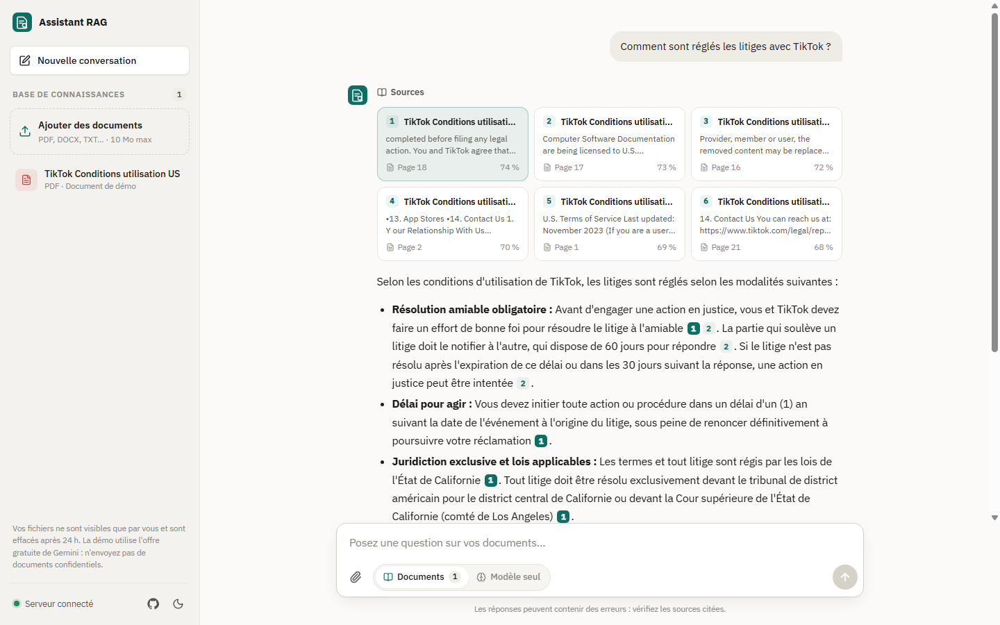
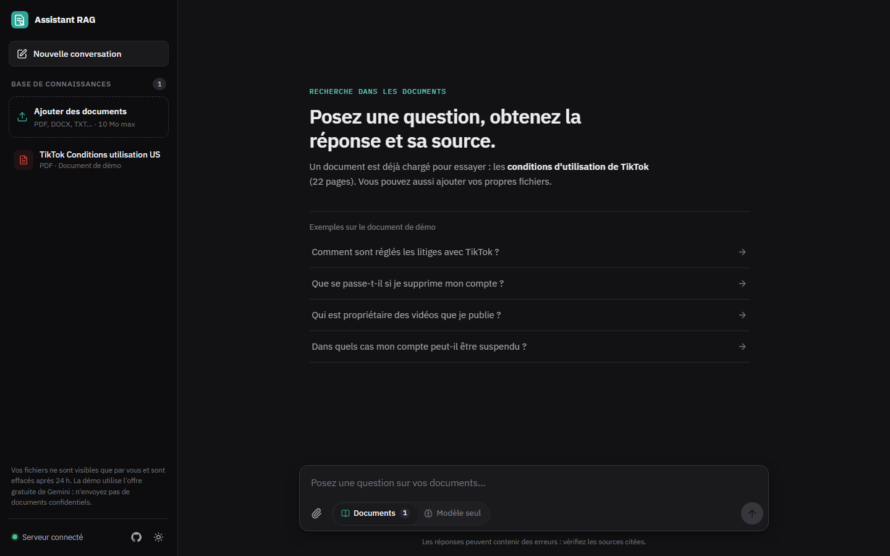
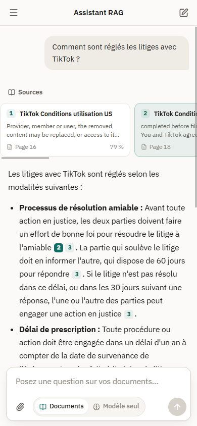
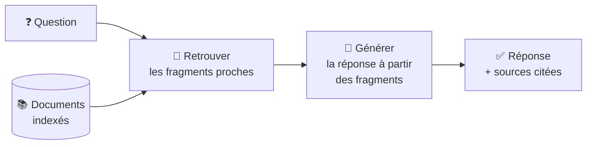
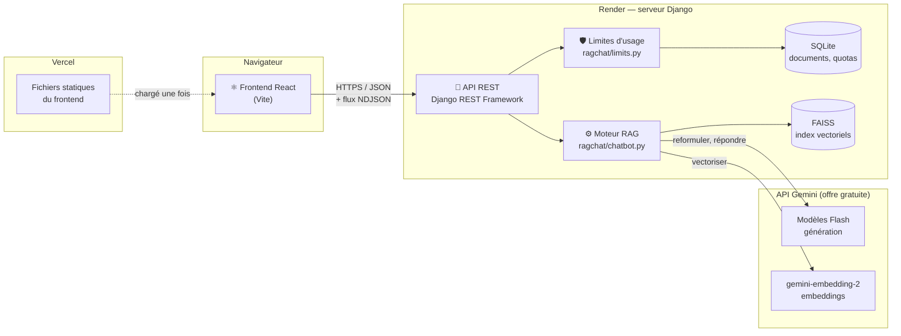
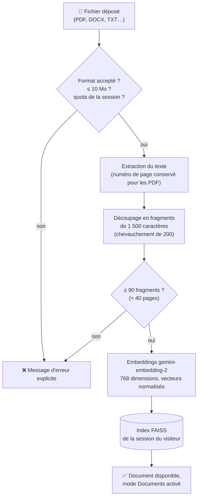
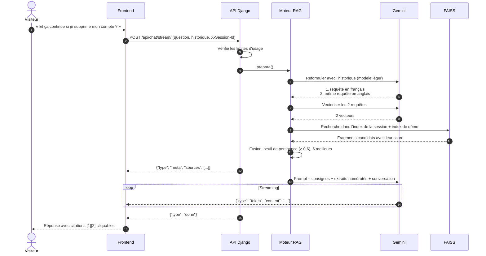
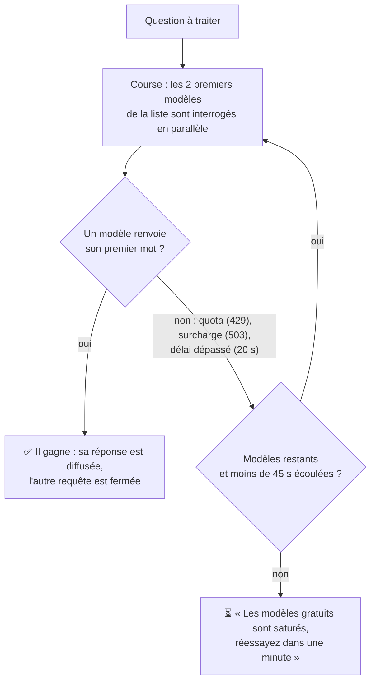
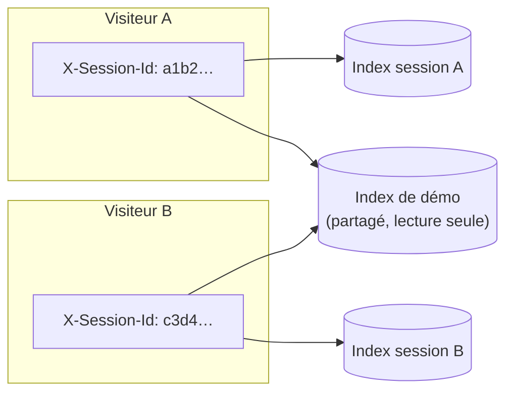
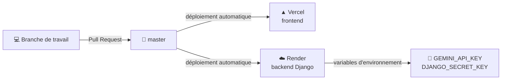

# RAG Chatbot

Un assistant qui **répond aux questions à partir de vos documents** et **cite ses sources** (document, page, extrait). Déposez un PDF, posez une question : la réponse s'appuie uniquement sur le contenu retrouvé dans le document.

**Stack** : React 18 (Vite) · Django REST Framework · FAISS · API Gemini (offre gratuite) · déployé sur Vercel et Render



<table>
  <tr>
    <td width="68%"></td>
    <td width="32%"></td>
  </tr>
  <tr>
    <td align="center"><sub>Accueil (thème sombre)</sub></td>
    <td align="center"><sub>Version mobile</sub></td>
  </tr>
</table>

## Sommaire

1. [Fonctionnalités](#fonctionnalités)
2. [Le RAG en une minute](#le-rag-en-une-minute)
3. [Architecture](#architecture)
4. [Ajout d'un document](#ajout-dun-document)
5. [Parcours d'une question](#parcours-dune-question)
6. [Fiabilité sur l'offre gratuite](#fiabilité-sur-loffre-gratuite)
7. [Sessions et limites d'usage](#sessions-et-limites-dusage)
8. [Organisation du code](#organisation-du-code)
9. [API](#api)
10. [Lancer le projet en local](#lancer-le-projet-en-local)
11. [Déploiement](#déploiement)
12. [Configuration](#configuration)
13. [Tests et évaluation](#tests-et-évaluation)
14. [Choix techniques et limites](#choix-techniques-et-limites)

---

## Fonctionnalités

| | |
|---|---|
| 📄 **Vos documents** | PDF, DOCX, TXT, Markdown, HTML, CSV, JSON, XML, par glisser-déposer |
| 🔎 **Réponses sourcées** | Chaque affirmation est citée `[1]`, `[2]`… ; un clic affiche l'extrait exact et sa page |
| 🌍 **Multilingue** | Une question en français trouve les passages d'un document en anglais |
| 💬 **Conversation** | Les questions de suivi (« et pour les mineurs ? ») sont comprises dans leur contexte |
| 🚫 **Pas d'invention** | Hors sujet ou information absente : l'assistant le dit au lieu d'inventer |
| ⚡ **Streaming** | La réponse s'affiche au fur et à mesure qu'elle est générée |
| 🔒 **Confidentialité** | Chaque visiteur ne voit que ses documents, effacés après 24 h |
| 🎨 **Interface** | Thème clair et sombre, version mobile, document de démonstration préchargé |
| 🧠 **Deux modes** | *Documents* (RAG) ou *Modèle seul* (connaissances générales du modèle) |

## Le RAG en une minute

Un modèle de langage ne connaît pas vos documents. Le **RAG** (*Retrieval-Augmented Generation*) les lui fournit au moment de la question :

1. **Indexer** : chaque document est découpé en fragments, et chaque fragment est transformé en vecteur (*embedding*) qui représente son sens.
2. **Retrouver** : la question est transformée en vecteur à son tour, puis on cherche les fragments dont le sens est le plus proche.
3. **Générer** : le modèle reçoit la question **et** ces fragments, avec la consigne de répondre uniquement à partir d'eux, en les citant.



## Architecture



| Brique | Rôle |
|---|---|
| **Frontend** (`frontend/`) | Interface de chat, envoi des documents, affichage des sources. Ne contient **aucune clé d'API** : il ne parle qu'au backend. |
| **API Django** (`backend/ragchat/views.py`) | Points d'entrée HTTP, validation, sessions, limites d'usage, streaming de la réponse. |
| **Moteur RAG** (`backend/ragchat/chatbot.py`) | Lecture des fichiers, découpage, embeddings, recherche FAISS, construction du prompt, appels à Gemini. |
| **FAISS** | Base vectorielle locale : un index pour le document de démo (versionné dans le dépôt), un index par session de visiteur. |
| **SQLite** | Liste des documents de chaque session et compteurs d'usage. |
| **Gemini** | `gemini-embedding-2` pour les vecteurs, modèles Flash pour la reformulation et la réponse. |

## Ajout d'un document



- **Pourquoi découper ?** Un document entier est trop long et trop varié pour être représenté par un seul vecteur. Des fragments de 1 500 caractères correspondent à un ou deux paragraphes : assez de contexte pour être compris, assez court pour être précis. Le chevauchement évite de couper une idée en deux.
- **Pourquoi normaliser les vecteurs ?** Pour des vecteurs de longueur 1, la distance renvoyée par FAISS se convertit directement en similarité cosinus (`1 − d² / 2`), un score entre 0 et 1 facile à interpréter et à comparer à un seuil.
- **Suppression** : chaque fragment porte l'identifiant de son document, ce qui permet de retirer un document de l'index **sans recalculer** les autres.

## Parcours d'une question



Les étapes clés :

1. **Reformulation** : « Et ça continue ? » ne veut rien dire seul. Un modèle léger la réécrit en requête autonome (« TikTok conserve-t-il les droits sur mes vidéos après la suppression du compte ? »), **dans la langue de la question et en anglais**. La recherche en anglais retrouve les passages d'un document anglais demandés en français.
2. **Recherche** : les deux requêtes sont cherchées dans l'index du visiteur et dans celui du document de démo ; chaque fragment garde son meilleur score.
3. **Seuil de pertinence** : les fragments sous **0,6** de similarité sont écartés. Le seuil a été calibré sur de vraies questions : les passages pertinents obtiennent 0,65 à 0,8, les questions hors sujet moins de 0,58. S'il ne reste rien, l'assistant répond qu'il n'a rien trouvé, **sans inventer**.
4. **Prompt** : les 6 meilleurs extraits sont placés dans les instructions, numérotés, avec leur document et leur page :

   ```xml
   <extrait numero="1" document="TikTok_Conditions_utilisation_US.pdf" page="18">
   …texte du fragment…
   </extrait>
   ```

   Les consignes imposent de répondre uniquement à partir des extraits, de citer chaque affirmation (`[1]`, `[2][3]`) et de dire clairement ce qui manque.
5. **Streaming** : la réponse arrive en [NDJSON](https://github.com/ndjson/ndjson-spec), un objet JSON par ligne : `meta` (sources), puis des `token`, puis `done`. Le frontend affiche le texte au fur et à mesure et transforme les `[n]` en pastilles cliquables.

## Fiabilité sur l'offre gratuite

L'offre gratuite de Gemini ne coûte rien, mais ses modèles sont souvent saturés (erreurs 503, lenteurs, quotas par minute). Le moteur ne dépend donc d'aucun modèle en particulier :



- **Course entre modèles** : chaque modèle gratuit a son propre quota et sa propre charge. En interroger deux à la fois et garder le premier qui répond évite d'attendre qu'un modèle saturé expire.
- **Repli** sur toute la gamme Flash gratuite (`gemini-3.5-flash-lite`, `gemini-3.1-flash-lite`, `gemini-3.6-flash`, …), dans l'ordre de latence mesurée.
- **Le repli a lieu avant le premier mot** : l'utilisateur ne voit jamais une réponse commencer puis s'interrompre à cause d'un changement de modèle.
- **Embeddings** : le quota gratuit est de 100 textes par minute. En cas de dépassement, le moteur attend le délai indiqué par l'API avant de réessayer. L'**index du document de démo est versionné** (`backend/demo_docs/demo/`), si bien qu'un serveur qui se réveille ne recalcule rien.
- **Réveil du serveur** : l'hébergement gratuit de Render s'endort après 15 minutes d'inactivité. Le frontend appelle `/api/health/` dès l'ouverture de la page et affiche « Démarrage du serveur… » pendant le réveil (jusqu'à une minute).

## Sessions et limites d'usage



- **Sessions** : le frontend génère un identifiant aléatoire (stocké dans le navigateur) et l'envoie dans l'en-tête `X-Session-Id`. Chaque session a son propre index FAISS : un visiteur ne voit, n'interroge et ne supprime que ses documents. Les sessions inactives depuis 24 h sont effacées.
- **La clé d'API ne quitte jamais le serveur** : elle vit dans les variables d'environnement de Render (et dans `backend/.env` en local, ignoré par git).
- **Limites**, pour rester sous les quotas gratuits et partager l'accès entre visiteurs :

| Limite | Valeur par défaut |
|---|---|
| Questions par visiteur | 20 par heure, 60 par jour |
| Questions pour tout le site | 300 par jour |
| Documents par session | 5 |
| Taille d'un document | 10 Mo et 90 fragments (≈ 40 pages) |
| Longueur d'un message | 2 000 caractères |

Au-delà, l'API répond `429` avec un message clair. Les visiteurs sont identifiés par un hachage de leur adresse IP : l'adresse elle-même n'est jamais stockée.

## Organisation du code

```text
rag_chatbot/
├── backend/                         API Django + moteur RAG
│   ├── ragchat/
│   │   ├── chatbot.py               ⚙️ Moteur : lecture, découpage, embeddings, FAISS, Gemini
│   │   ├── views.py                 🌐 Points d'entrée HTTP, sessions, streaming
│   │   ├── limits.py                🛡️ Limites d'usage par visiteur et globales
│   │   ├── models.py                Document (par session), UsageRecord (quotas)
│   │   ├── serializers.py           Validation des requêtes
│   │   └── urls.py                  Routes /api/…
│   ├── ragchat_backend/settings.py  Configuration Django (.env, CORS, logs)
│   ├── demo_docs/                   Document de démo + son index FAISS versionné
│   ├── requirements.txt
│   └── .env.example                 Modèle de configuration
├── frontend/                        Interface React (Vite)
│   └── src/
│       ├── App.jsx                  État de l'application, envoi des questions et des fichiers
│       ├── lib/api.js               Appels HTTP, session, lecture du flux NDJSON
│       ├── lib/useTheme.js          Thème clair / sombre
│       └── components/
│           ├── Sidebar.jsx          Base de connaissances, état du serveur
│           ├── EmptyState.jsx       Écran d'accueil et exemples
│           ├── Message.jsx          Réponse, cartes de sources, citations cliquables
│           ├── Composer.jsx         Zone de saisie, choix Documents / Modèle seul
│           └── Toast.jsx            Notifications
├── docs/images/                     Captures du README
└── main.py                          Petit client en ligne de commande
```

## API

| Méthode | Route | Description |
|---|---|---|
| `GET` | `/api/health/` | État du serveur (sert aussi à le réveiller) |
| `GET` | `/api/documents/` | Documents de la session + document de démo |
| `POST` | `/api/documents/` | Ajouter un document (`multipart/form-data`, champ `file`) |
| `DELETE` | `/api/documents/<id>/` | Supprimer un document de la session |
| `POST` | `/api/chat/stream/` | Poser une question, réponse en flux NDJSON |
| `POST` | `/api/chat/` | Poser une question, réponse complète en JSON |

Toutes les routes, sauf `/health/`, attendent l'en-tête `X-Session-Id`. Corps d'une question :

```json
{
  "message": "Comment sont réglés les litiges ?",
  "mode": "rag",
  "history": [{ "role": "user", "content": "…" }, { "role": "assistant", "content": "…" }]
}
```

`mode` vaut `rag` (réponse à partir des documents) ou `direct` (modèle seul).

## Lancer le projet en local

**Prérequis** : Python 3.11+, Node.js 18+, une clé Gemini gratuite ([aistudio.google.com/apikey](https://aistudio.google.com/apikey), sans carte bancaire).

```bash
# 1. Backend
cd backend
python -m venv .venv
.venv\Scripts\activate            # Windows  (macOS/Linux : source .venv/bin/activate)
pip install -r requirements.txt
cp .env.example .env              # puis renseignez GEMINI_API_KEY dans .env
python manage.py migrate
python manage.py runserver 8000

# 2. Frontend (dans un second terminal)
cd frontend
npm install
npm run dev                       # http://localhost:5173
```

En local, le frontend appelle `http://localhost:8000/api`. Pour une autre adresse, définissez `VITE_API_BASE_URL`, par exemple `VITE_API_BASE_URL=http://127.0.0.1:8010/api npm run dev`.

## Déploiement



- **Render** (backend) : service web Python dont la racine est `backend/`. Il installe `requirements.txt`, applique les migrations (`python manage.py migrate`) et sert l'application avec `gunicorn ragchat_backend.wsgi`. Variables à définir : `GEMINI_API_KEY`, `DJANGO_SECRET_KEY`.
- **Vercel** (frontend) : racine `frontend/`, commande `npm run build`, dossier `dist/`. En production, le frontend appelle automatiquement l'API Render.

## Configuration

Toutes les valeurs ont un défaut raisonnable ; seule `GEMINI_API_KEY` est obligatoire.

| Variable | Défaut | Rôle |
|---|---|---|
| `GEMINI_API_KEY` | — | Clé Gemini (obligatoire) |
| `GEMINI_MODELS` | `gemini-3.5-flash-lite,gemini-3.1-flash-lite,gemini-3.6-flash,…` | Modèles de réponse, dans l'ordre de préférence |
| `GEMINI_REWRITE_MODELS` | `gemini-3.1-flash-lite,gemini-3.5-flash-lite,gemini-3.6-flash` | Modèles de reformulation |
| `GEMINI_RACE_WIDTH` | `2` | Nombre de modèles interrogés en parallèle |
| `GEMINI_ANSWER_TIMEOUT` | `20` | Délai maximum (s) avant le premier mot d'un modèle |
| `GEMINI_FALLBACK_BUDGET` | `45` | Temps maximum (s) consacré aux replis |
| `GEMINI_EMBEDDING_MODEL` | `gemini-embedding-2` | Modèle d'embeddings (768 dimensions) |
| `RAG_TOP_K` | `6` | Nombre d'extraits fournis au modèle |
| `RAG_MIN_RELEVANCE` | `0.6` | Similarité cosinus minimale d'un extrait |
| `RAG_MAX_QUESTIONS_PER_HOUR` | `20` | Questions par visiteur et par heure |
| `RAG_MAX_QUESTIONS_PER_DAY` | `60` | Questions par visiteur et par jour |
| `RAG_MAX_QUESTIONS_GLOBAL_PER_DAY` | `300` | Questions par jour pour tout le site |
| `RAG_MAX_DOCUMENTS_PER_SESSION` | `5` | Documents par session |
| `RAG_MAX_CHUNKS_PER_DOCUMENT` | `90` | Taille maximale d'un document, en fragments |
| `DJANGO_SECRET_KEY` | valeur de développement | Clé secrète Django (à définir en production) |
| `VITE_API_BASE_URL` | local : `http://localhost:8000/api` | URL de l'API pour le frontend |

## Tests et évaluation

- **Tests de bout en bout** avec un client Gemini simulé : vrai Django, vrai FAISS, vrai PDF. Ils couvrent les sessions isolées, le seuil de pertinence, la reformulation, le repli entre modèles, les réponses bloquées ou tronquées, le streaming, les limites d'usage, l'ajout et la suppression de documents.
- **Évaluation réelle** sur le document de démo, avec l'API Gemini :

| Question | Résultat |
|---|---|
| « Comment sont réglés les litiges avec TikTok ? » | ✅ Réponse complète et sourcée : résolution amiable, délai de 60 jours, tribunaux de Californie, prescription d'un an |
| « Et ça continue si je supprime mon compte ? » (suivi) | ✅ Question reformulée avec son contexte, réponse sourcée |
| « À partir de quel âge peut-on créer un compte ? » | ✅ Indique ce que le document précise (moins de 18 ans : accord parental) et ce qu'il ne dit pas |
| « Quelle est la capitale de l'Australie ? » | ✅ Aucun passage pertinent : l'assistant le dit, sans inventer |

## Choix techniques et limites

| Choix | Pourquoi |
|---|---|
| **FAISS** plutôt qu'une base vectorielle hébergée | Aucun service ni compte supplémentaire ; les volumes (quelques documents par visiteur) tiennent largement en mémoire. |
| **Gemini, offre gratuite** | Une seule clé pour la génération et les embeddings, aucun coût : adapté à une démo publique. |
| **Streaming NDJSON** plutôt que WebSocket | Une simple requête HTTP suffit ; fonctionne derrière n'importe quel proxy et avec `fetch`. |
| **Index de démo versionné** | L'hébergement gratuit efface le disque au redémarrage ; recalculer l'index consommerait le quota d'embeddings à chaque réveil. |
| **Reformulation bilingue** | Les embeddings multilingues rapprochent mal une question française d'un texte juridique anglais ; une requête en anglais corrige ce biais. |

**Limites connues**

- Sur l'offre gratuite, le temps de réponse varie de 2 s à une vingtaine de secondes selon la charge de Google, et peut afficher « réessayez dans une minute » aux heures de pointe.
- Les données envoyées à l'offre gratuite de Gemini peuvent être utilisées par Google pour améliorer ses produits : l'interface déconseille d'y déposer des documents confidentiels.
- Les documents des visiteurs sont temporaires par conception : effacés après 24 h ou au redémarrage du serveur gratuit.
- Les PDF scannés (images sans texte) ne sont pas lus : il faudrait ajouter une étape d'OCR.
